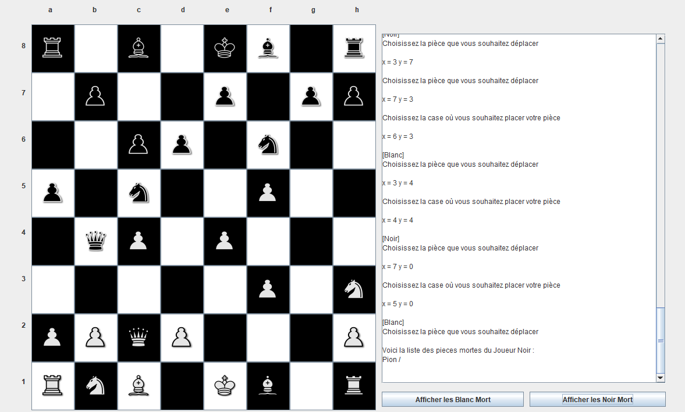
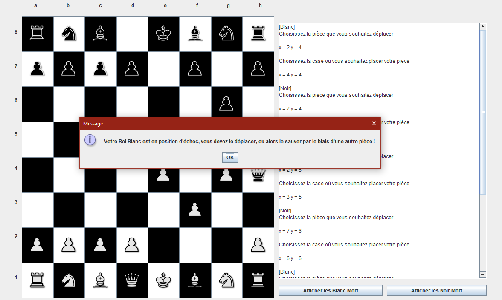
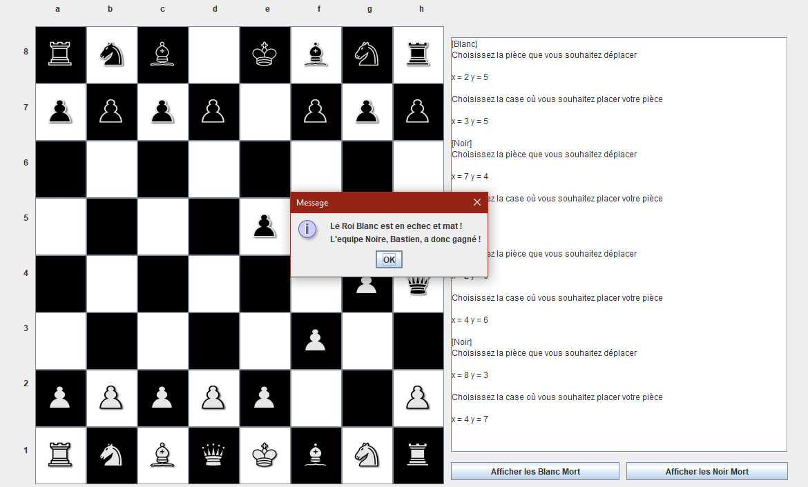

<h1>Présentation :</h1>
Réalisation du jeu d'echec avec interface graphique simple en langage Java

<h1>Exemple d'interface :</h1>

<h2>Phase de jeu aléatoire</h2>

  

<h2>Echec, besoin de déplacer le ROI</h2>

  

<h2>Echec et Math</h2>

  

